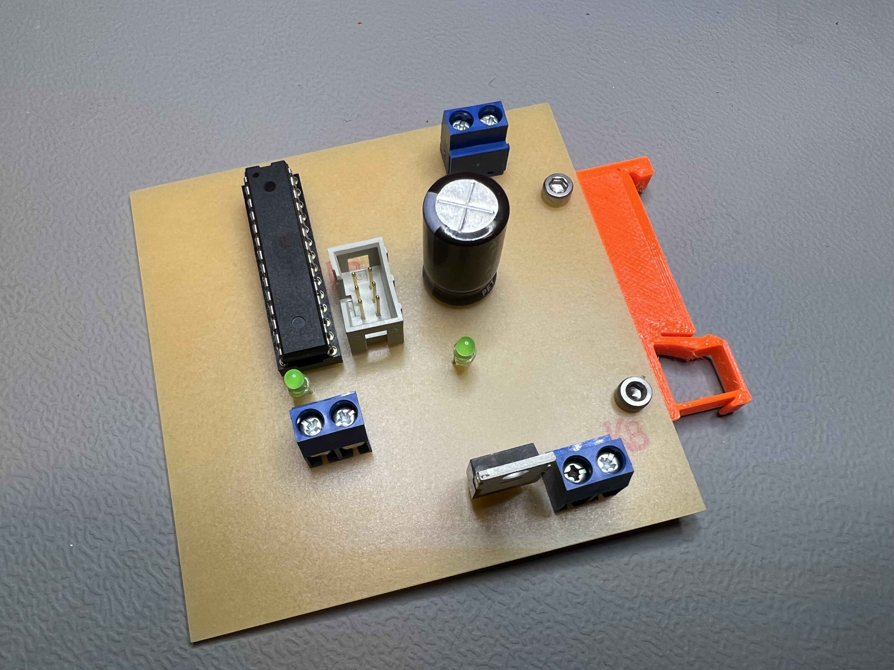

# Using Unifi G4 doorbell with an existing wireless bell
We had an existing wireless doorbell with a button cell powered pushbutton at our coworking-/hackerspace in use when a Unifi G4 doorbell found its way to us.
Having the ability to have multiple people being notified on their phone when someone is at the door is great combined with video and audio intercom.

We still wanted to use our existing doorbell for everyone present and who is not part of the Unifi system.

The G4 doorbell has no other output but came with a module that can be wired into the power lines claiming to be able to power a physical bell. Some tests and online search later I concluded that I do not really understand what this module exactly does and how to use its output. The only thing I know is, that the G4 shorts the power lines if someone pushes the button. If just the bell transformer is used, the voltage (18V AC) collapses, the G4 lets go of the short and everything is idle again. Using DC power seems to lead to the G4 reacting different by not letting go of the short and therefore loosing power and shutting down after a couple of seconds. If a different transformer than the one supplied or a DC power supply is used this might lead to damage or worse, so be careful and do so at your own risk!

My approach is as follows: Half wave rectify the AC voltage from the transformer so it can be switched with a power MOSFET (the G4 has its own rectifier inside so it ends up as DC anyway). In order to detect the short a microcontroller monitors the voltage, when a short is detected it disconnects power to the G4, powers up the transmitter buttom from our existing doorbell (tape used to continuously press the button and just provide power to the battery pins) and switches the power to the G4 back on. Some filtering and buffering of the power supplied to the microcontroller is neccessary as there is a disruption of power due to the short.

The finished module and the transformer were mounted on a DIN rail inside the case of an intruder alarm unitcentral unit.

